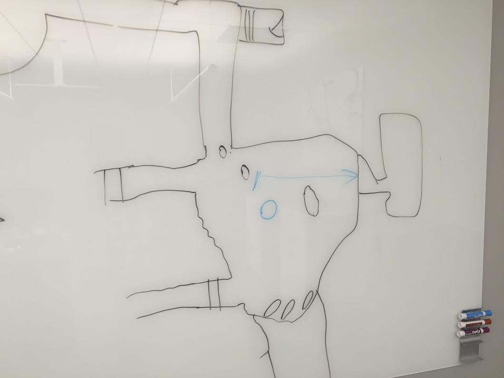

# Session 10 - What are we even doing?

After killing the folks on the underground platform, our heroes were left standing in front of a magically locked door. They tried a bunch of things (including magic, smashing the door with hammers and trying to tunnel around the side of the door), but nothing worked; they were stuck. They got into their boats and headed south into another grotto. There were several exits from the giant chamber, a rock off to the side and a pool of bubbles in the center. The team rowed towards the bubbles and a giant water spirit with a huge trident appeared and started attacking the party immediately. In one attack, the being knocked Fear unconscious and into the water and damaged other members of the party. This seemed like pretty bad news, so the party noped the fuck out of there, dragging the unconscious Fear with them.

Drusillia turned into a shark and went to talk to the other shark from before, but did not find out much. The water being was _probably_ Gar Shatterkeel, since he was known to carry a trident and be powerful, but we did not confirm this.

The party decided to head back to the castle and go elsewhere. Traveling west, the party came upon a stone building. Knocking on the front door, the party decided to bluff their way in. The building was a monastery, seemingly belonging to the earth cult we'd heard of before; the cult of the Black Earth. The party told them about the slaughter at Rivergard Keep, but implied that the air cult were responsible by mentioning Griffons (we found out the air cult is called ???) and that we were initiates  in the water cult. They seemed to believe us, and were open to us joining their cult.

We met the leader of the monastery, Qarbo, who said he was the second in command of this cult. The leader was Helenrae, the abbess, and they worshipped the Prophet Marlos Enrayl (who might be the equivalent of Gar Shatterkeel, which Helenrae was their Jolliver). Qarbo interviewed the party members and were happy with our lies. We found out that Mordain was the original dedication of the Temple, a lawful good god of dwarfs and chief deity. We thought that the cult may be connected to the other dwarven temples via underground tunnels.

We were all ready to join the cult, when Qarbo told us we would need to surrender all of our weapons and possessions. That was a no-go, and we let them know. They said that this was ok, but seemed to lying. We went into the main room at the center of the temple, and the floor dropped away, dropping us into a pit. A giant (but unhealthy looking) Umber Hulk with giant mandibles attacked, but we killed it very quickly. The monastery staff were a little scared of us, so let us join the cult. We went to sleep in the barracks rooms, along with some cave dwarves, including one called Durgar.

Aelar wondered if he could run a brothel out of this temple?