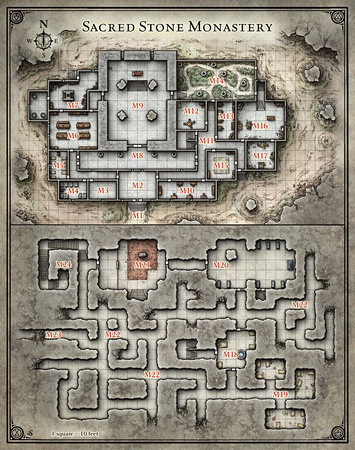

# Session 11 - Murder in the Monastery

The group awoke to their first day in the monastery. Over a breakfast of bacon and no eggs, they heard from Raz about the key fragment in Helenrae's room. They discussed various plans to steal the fragment, including setting fire to everything, setting fire to brandy in the stairwell, killing everyone quietly, killing everyone loudly, total stealth, partial stealth, etc. The gargoyles in the entrance chamber (M8) were magical (2 of the 4, anyway) and seemed pretty likely to murder us.

We went about our chores, with Fear and Anais helping with the brandy distillation. Fear asked way too many questions to Dave about the making brandy process, and found out that wine was being made somewhere on the lower floor by someone called Ephail. Fear and Anais then went downstairs, bluffing their way past the ogre by guessing the secret hand sign (the triangle of the cult) and went looking for the wine maker. When they found him, they claimed that they were sent by Dave to help. He clearly needed no help, since he had cells full of prisoners/slaves that he was using, plus he was mostly sitting around. He tasked them with taking a barrel of wine upstairs for Dave.

Instead, they rolled the barrel all around the basement, exploring the various rooms. There were lots of unfinished mineshafts (unclear if never dug out, or collapsed long ago), one recently collapsed (and drafty) mineshaft, a stairway down, protected by a weak-looking iron gate that had not seen much recent use and a thick iron door which the Umber Hulk had been behind. This door was locked. Finally, they came upon an old crypt, with a stuck door that had not been opened in some time. Inside were a bunch of skeletons and an ornate stone sarcophagus, which was empty but inscribed with "?????" in common. When fear went near (but did not touch!) a skeleton, 6 of them came to life. Fear and Anais finished them off quickly and found a jeweled ring and a magic ring of Fire Resistance. The crypt also included a door which presumably led up to M16, but was locked with the same magical ward as above. With the basement explored, they took their wine barrel upstairs, past the bored ogre guards, to the brandy maker.

That evening over dinner, the team planned to perform some murders, after enough rest to recharge spell slots and for Fear to learn Dispell Magic so that we could unlock the magic door. Waking up at 2 am, Drusillia turned into a giant spider (the most stealthy animal) and snuck with Raz into Helenrae's room. Daar waited in M2 so she'd be close by if things went crazy (but not in M8 where the gargoyles were). They successfully snuck in, but when Raz went to grab the key, Helenrae immediately woke up and shouted for the guards.

The combat kicked off in her room, with Daar running in to help give a beat down. The remaining team (Azaghal, Anais and Fear) ran from the barracks once they heard the commotion. Unfortunately, the 7 other monks and guards in the room with them immediately chased after them with the intent to kill; it seems like they had been told this would happen. Unfortunately for Azaghal, he had the shortest legs and was surrounded pretty quickly. He managed to take down 2 of them as he ran, but was knocked unconscious as he turned the corner into the M11 space. In the meantime, the two predictable gargoyles had appeared from M8 and joined the combat. The guard outside Helenrae's room went down first, shortly followed by the abbess herself. The gargoyles were next, followed by the 5 remaining guards who had taken down Azaghal. We slaughtered them all quickly, and healed up Azaghal. Looting Helenrae's room, we took the key shard, some gold and gems and maybe some other stuff.

There was still a bunch more guards and monks elsewhere in the monastery, as well as more gargoyles in the garden (M14) which might come to life, and the ogres and whatever in the basement. The team will need to decide whether to bail now that they have the key, or whether to break into the magically locked room, explore the mineshaft, the underground staircase, or elsewhere in the monastery.